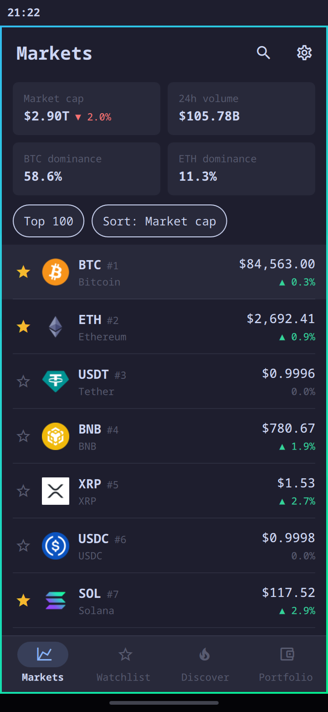

# Crypto Market

CoinGecko as an Omarchy app: live prices, coin pages, a watchlist and a
portfolio, in one panel that lays itself out for the desktop and for the phone.




## What it does

- **Markets**: the top 100, 250, 500 or 1,000 coins by market cap, with price,
  1h/24h/7d change, volume, market cap and a 7-day sparkline. Sort by any
  column. Above the list: total market cap, 24h volume, and BTC and ETH dominance.
- **Coin pages**:
  - a price chart for 24h, 7d, 1M, 3M, 1Y or Max, with a crosshair
  - the change over 1h, 24h, 7d, 30d and 1y
  - the 24h range
  - market cap, fully diluted valuation, volume, and circulating, total and max supply
  - all-time high and low, with dates
  - the project's description, categories and links
- **Watchlist**: star any coin to follow it.
- **Discover**:
  - trending coins on CoinGecko
  - the day's biggest gainers and losers among the top 250 (anything under
    $50K of volume is left out)
  - every category by market cap
- **Search**: find any coin CoinGecko lists.
- **Converter**: coin to currency and back, on every coin page.
- **Portfolio**: record buys and sells to see today's value, the 24h change,
  profit and loss per coin, and an allocation bar.
- **15 currencies**, including BTC, ETH and sats.

It opens instantly and offline with the last prices it saw, and it refreshes
only while it is open.

## Install

```sh
omarchy plugin add https://github.com/SimonSchubert/omarchy-crypto-market.git --enable
```

To open it, bind a key in `~/.config/hypr/bindings.lua`:

```lua
o.bind("SUPER + SHIFT + C", "Crypto Market", "omarchy-shell shell toggle io.github.simonschubert.crypto-market")
```

Or run `omarchy-shell shell toggle io.github.simonschubert.crypto-market` from
anywhere.

The first time it loads, Crypto Market also adds itself to Omarchy's app menu,
so you can search for it by name. It does this once, and only if no entry by
that name exists yet. **Settings → App launcher** hides or shows the entry.

On Omarchy Mobile it appears in the app drawer as its own app.

## Remove

```sh
omarchy plugin remove io.github.simonschubert.crypto-market
```

That removes the plugin itself. Your settings, watchlist and portfolio stay in
`~/.local/state/crypto-market/`, the saved prices and logos stay in
`~/.cache/crypto-market/`, and the app menu entry stays in
`~/.local/share/applications/`. To remove those as well:

```sh
rm -rf ~/.local/state/crypto-market ~/.cache/crypto-market
rm -f ~/.local/share/applications/omarchy-plugin-io.github.simonschubert.crypto-market.desktop
```

If you added a keybinding, remove it from `~/.config/hypr/bindings.lua`.

## Requirements

Omarchy with its Quickshell shell, and network access to `api.coingecko.com`.
It installs no packages and changes no Omarchy configuration. It reads and
writes only its own files, listed below.

## Keys (desktop)

| Key | Action |
| --- | --- |
| `1`–`4` | Markets, Watchlist, Discover, Portfolio |
| `/` | Search |
| `↑` `↓` `Enter` | Move through a list, open a coin |
| `←` `→` | Chart range on a coin page |
| `f` | Star or unstar the selected coin |
| `r` | Refresh |
| `Esc` | Back, then close |

## Rate limits and the API key

CoinGecko's free public API answers only a few requests a minute. The app
spaces its requests out and caches every answer. When CoinGecko asks it to
slow down, it keeps showing the prices it has and retries by itself.

For more headroom, create a free **Demo** key at
[coingecko.com/en/developers/dashboard](https://www.coingecko.com/en/developers/dashboard)
and paste it into Settings. The key is stored in
`~/.local/state/crypto-market/prefs.json` and is sent only to CoinGecko.

## Privacy and security

- The only network access is HTTPS requests from QML to `api.coingecko.com`,
  plus coin logos from CoinGecko's image CDN.
- It runs no shell commands. At startup it runs `install -d -m 700` on its
  own state and cache folders, and `chmod 600` on its two data files, so
  your API key and portfolio are readable only by you. It runs no other
  processes. If either step fails, it saves nothing and says so on screen.
- It writes only these files:
  - `~/.local/state/crypto-market/prefs.json`: settings, watchlist, portfolio
    and the optional API key
  - `~/.cache/crypto-market/`: the last prices, for opening offline, and the
    coin logos
  - `~/.local/share/applications/omarchy-plugin-io.github.simonschubert.crypto-market.desktop`:
    its app menu entry, created once and never over an existing file
- Project descriptions are shown as plain text. Links open in your browser,
  and only `https:` links are opened.

## Credits

Market data by [CoinGecko](https://www.coingecko.com). This is not financial advice.

MIT licensed.
